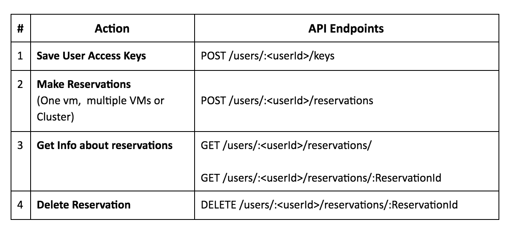
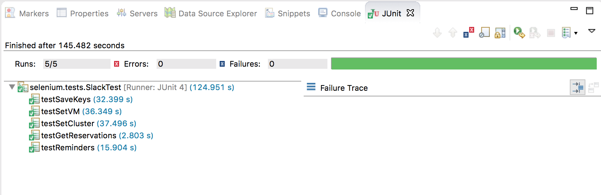
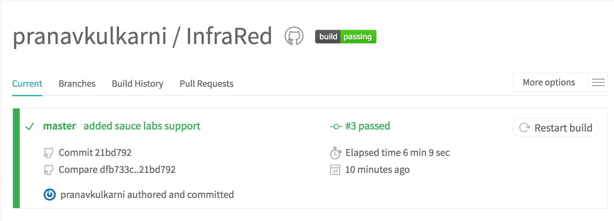
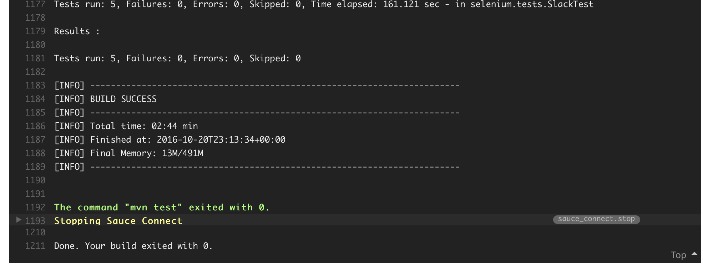
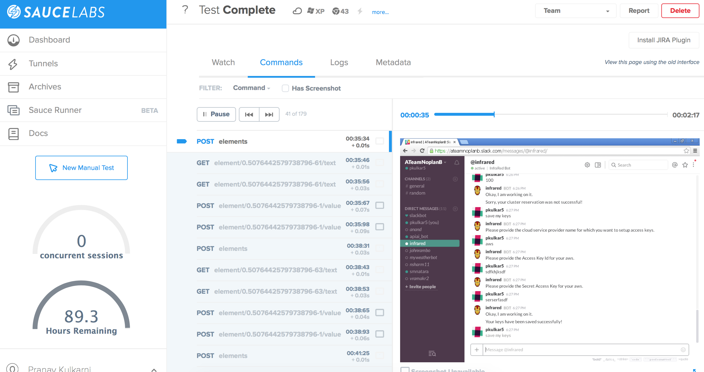

## Design Summary

	

Based on our design, there are two main components of this project. Their responsibilities are summarized below :
### Bot
1. Node.js application which handles complete interaction between the end user
2. Makes calls to the [API.AI](https://api.ai/) service to get user intent by leveraging their powerful natural language understanding platform
3. Maps intent to action and makes calls to the Provisioning Service.

Note: The Bot does not interact with a Database directly, everything via APIs of the Provisioning Service. Idea is to make the bot database agnostic.

###Provisioning Service
1. Serves Bot's requests for keys setup and provisioning.
2. Makes calls to cloud service provider APIs (AWS/DigitalOcean) to provision VMs and Cluster.
3. Maintains keys and reservation information per user in a database (Redis or MongoDB) and exposes APIs over it.


### Use Cases

####Use Case 1: Configure InfraRed bot with Cloud Service Provider Access Keys
```
1 Preconditions
    User must have an AWS/DigitalOcean account and have valid Access keys
2 Main Flow
	User will mention his/her access keys to the slack bot as a direct mention [S1]. 
	Bot validates the keys [S2]. 
	Bot saves the keys and sends the confirmation that the key has been saved [S3]
3 Subflows
    [S1] User asks bot to setup keys in natural language and provides the access keys
    [S2] Bot tests the access keys
    [S3] Bot makes the necessary API call to the Provisioning service to store keys in a database
4 Alternative Flows
    [E1] Bot could not authenticate the key
    [E2] Keys were not saved to the database
```

####Use Case 2: Set up VMs
```
1 Preconditions
    User must have configured his/her access keys
2 Main Flow
	User will describe his/her request for setting up a VM [S1]. 
	Bot will validate the configured keys [S2]
	Bot will make the request to our “provisioning service”. The provisioning service will save  reservation information in a database[S3]. 
	Bot will provide confirmation to the user once the request is fulfilled [S4]. 
	Bot asks the user if this config needs to be stored as a new template or update an existing template [S5].
	Based on user's reply, the bot will take appropriate action. [S6]

3 Subflows
    [S1] User provides a request stating his requirements (default or custom) containing parameters such as service name, OS, storage, vCPU, reservation time etc.
    [S2] Bot will validate the configured keys, by making a dry run request
    [S3] Bot checks the details for completeness and passes on the request to the “provisioning service”
    [S4] Bot provides confirmation and required details like IP address for the user to login
    [S5] Bot asks the user if this config needs to be stored as a new template or update an existing template
    [S6] Based on user's reply, the bot will prompt for a new template name if that template is not present in the datastore or the bot will prompt for an existing template name which needs to be updated with this config
4 Alternative Flows
    [E1] Missing information for certain fields in the user request in which case the bot requests for missing fields from the user.
    [E2] The service component may not provision the request due to some error in which case the bot notifies the user with the reason for failure.
    [E3] The bot is not able to save/update the template
```


####Use Case 3: Set up a cluster
```
1 Preconditions
    User must have configured his/her access keys
2 Main Flow
	User will describe his/her request for setting up a cluster [S1]. 
    Bot will authenticate the keys [S2] 
    Bot will provision the request and add the request information to a datastore [S3]. 
    Bot will provide confirmation to the user [S4]. 
    Bot asks the user if this config needs to be stored as a new template or update an existing template [S5]. 
    Based on user's reply, the bot will take appropriate action. [S6]
3 Subflows
    [S1] User provides a request stating his requirements (default or custom) with parameters like service name, OS, total memory, storage, number of nodes, reservation time etc.
    [S2] Bot authenticates the token by establishing a test connection
    [S3] Bot checks the details for completeness and passes on the request to provisioning service
    [S4] Bot provides confirmation and required details like IP address for the user to login
    [S5] Bot asks the user if this config needs to be stored as a new template or update an existing template
    [S6] Based on user's reply, the bot will prompt for a new template name if that template is not present in the datastore or the bot will prompt for an existing template name which needs to be updated with this config
4 Alternative Flows
    [E1] Missing information for certain fields in the user request in which case the bot requests for missing fields from the user.
    [E2] The service component may not provision the request due to some error in which case the bot notifies the user with the reason for failure.
    [E3] The bot is not able to save/update the template

```

####Use Case 4: Reservation extension
```
1 Preconditions
    A user must have an active reservation
2 Main Flow
    The bot will notify a user when a reservation comes close to an end [S1]. The user replies yes or no with parameters [S2] Bot will provision the request and update the request information against that reservation [S3]. Bot will provide confirmation to the user [S4].
3 Subflows
    [S1] Bot notifies a user whose reservation is coming close to an end (30 mins before the end time of the reservation).
    [S2] The user replies yes with parameters like number of hours for extension.
    [S3] Bot will provision the request and update the request information against that reservation
    [S4] Bot provides confirmation that the reservation has been extended.
4 Alternative Flows
    [E1] The user says no to extension of the reservation
    [E2] The service component is not able to extend the request
    [E3] The bot is not able to update the reservation information in the datastore
    [E4] The user does not reply anything to this notification in which case the bot tears down the reservation at the end of the reservation time.
```

####Use Case 5: User initiated tear down
```
1 Preconditions
    A user must have an active reservation
2 Main Flow
    The user informs the bot to tear down a reservation [S1]. The bot will issue the request to the service component [S2] Bot will provide confirmation [S3]
3 Subflows
    [S1] User notifies the bot to tear down a reservation of a VM or cluster
    [S2] The bot issues the request to the service component to end the request
    [S3] Bot deactivates the reservation from its datastore
    [S4] Bot provides confirmation that the reservation has been terminated.
4 Alternative Flows
    [E1] The service component is not able to terminate the reservation due to some error
    [E3] The bot is not able to deactivate the reservation information in the datastore
```

### Mocking Service Component


We have setup out Provisioning service as a Node.js server with the following endpoints.

	

The Bot makes calls to the Provisioning service which replies with the data from the following mock data file [mock.json](https://github.ncsu.edu/vramakr2/InfraRed/blob/master/provisioning_service/mock.json) 


### Bot Implementation

* **Bot Platform**: Our Bot is a Node.js application. We use Botkit to intercept and reply to messages between the User and the Node application. 
* **Bot Integration**: To have powerful natural language understanding, we have integrated our bot with API.AI which is a platform where we can train an AI to identify user intent. We have trained the AI as per our usecases mentioned above. API.AI provides a service to which we can send the intercepted messages and get an intent. The intents are then mapped to actions which are initiated by calling the provisioning service endpoints.

### Selenium Testing

To support testing of our bot, we have used Selenium to verify that the bot is returning the correct response based on an input message. We have tested happy and alternative/sad paths for each use case. In local configuration, we run mavenized tests in Eclipse and the testing happens on Chrome on the local machine. We have also added support for Sauce Labs to automate testing on other browsers and platforms. For more details on how to set up your environment and run tests, refer to [Selenium folder](https://github.ncsu.edu/vramakr2/InfraRed/tree/master/selenium)

Below is a snapshot of how tests are written. There is a setUp method which logs into Slack and connects with the InfraRed bot. There is a test for each use case. Below is a snapshot for save keys use case. Every use case test has two test cases viz. happy path where the conversation between the user and bot leads to successful saving of api keys and sad path where the conversation between the user and bot leads to failure of saving of api keys. Similar tests have been written for other use cases like set up vm, set up cluster, tear down reservation and show reservations. More details can be found here:

[SlackTest.java](https://github.ncsu.edu/vramakr2/InfraRed/blob/master/selenium/src/test/java/selenium/tests/SlackTest.java)

```java

	@BeforeClass
	public static void setUp() throws Exception {
		// driver = new HtmlUnitDriver();

		DesiredCapabilities caps = DesiredCapabilities.chrome();
		caps.setCapability("platform", "Windows XP");
		caps.setCapability("version", "43.0");

		driver = new RemoteWebDriver(new URL(URL), caps);

		ChromeDriverManager.getInstance().setup();
		driver = new ChromeDriver();

		driver.get("https://ateamnoplanb.slack.com/");

		// Wait until page loads and we can see a sign in button.
		WebDriverWait wait = new WebDriverWait(driver, 30);
		wait.until(ExpectedConditions.visibilityOfElementLocated(By.id("signin_btn")));

		// Find email and password fields.
		WebElement email = driver.findElement(By.id("email"));
		WebElement pw = driver.findElement(By.id("password"));

		// Type in our test user login info.
		email.sendKeys("<Your email>");
		pw.sendKeys("<password>");

		// Click
		WebElement signin = driver.findElement(By.id("signin_btn"));
		signin.click();

		// Wait until we go to general channel.
		wait.until(ExpectedConditions.titleContains("general"));

		// Switch to #bots channel and wait for it to load.
		driver.get("https://ateamnoplanb.slack.com/messages/@" + BOT_NAME + "/");

	}
	
	
	public static void doConvo(LinkedHashMap<String, String> inputs, String finalOutput) throws Exception {
		// Type something
		WebElement messageBot = driver.findElement(By.id("message-input"));

		for (String inp : inputs.keySet()) {
			messageBot.sendKeys(inp);
			messageBot.sendKeys(Keys.RETURN);
			Thread.sleep(2000);
			List<WebElement> message_contents = driver.findElements(By.xpath("//span[@class='message_body']"));
			System.out.println(message_contents.get(message_contents.size() - 1).getText());
			assertEquals(message_contents.get(message_contents.size() - 1).getText(), inputs.get(inp));
		}

		Thread.sleep(6000);
		List<WebElement> message_contents = driver.findElements(By.xpath("//span[@class='message_body']"));
		System.out.println(message_contents.get(message_contents.size() - 1).getText());
		assertEquals(message_contents.get(message_contents.size() - 1).getText(), finalOutput);
	}
	
	
	@Test
	public void testSaveKeys() throws Exception {
		// happy path
		LinkedHashMap<String, String> inputs = new LinkedHashMap<String, String>();
		inputs.put("save my keys",
				"Please provide the cloud service provider name for which you want to setup access keys.");
		inputs.put("aws", "Please provide the Access Key Id for your aws.");
		inputs.put("sdfkhjksdf", "Please provide the Secret Access Key for your aws.");
		inputs.put("serserfasdf", "Okay, I am working on it.");
		String finalOutput = "Your keys have been saved successfully!";

		doConvo(inputs, finalOutput);

		// sad path
		inputs = new LinkedHashMap<String, String>();
		inputs.put("save my keys",
				"Please provide the cloud service provider name for which you want to setup access keys.");
		inputs.put("aws", "Please provide the Access Key Id for your aws.");
		inputs.put("sdk", "Please provide the Secret Access Key for your aws.");
		inputs.put("serserfasdf", "Okay, I am working on it.");
		finalOutput = "Your keys could not be saved!";

		doConvo(inputs, finalOutput);

	}

```

#### Test Results



#### Travis CI and Sauce Labs automation of tests









### Task Tracking

[**Task tracking for Infrared**](./WORKSHEET.md)

### Screencast

[**Screencast of Bot**](https://youtu.be/wPWaUG35aUM)

