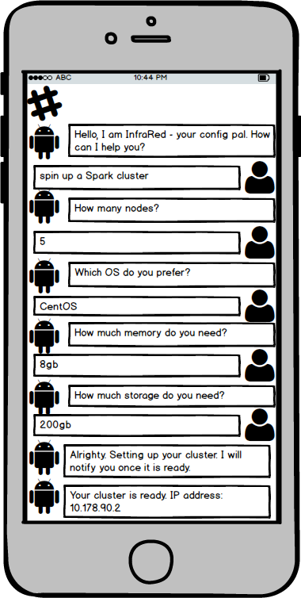
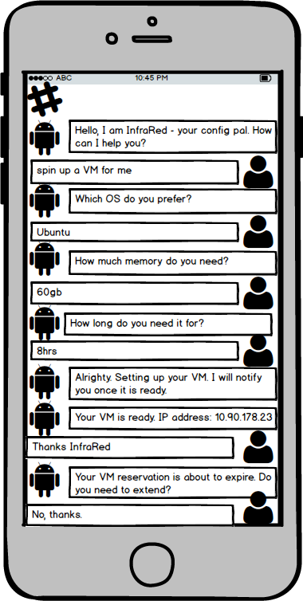
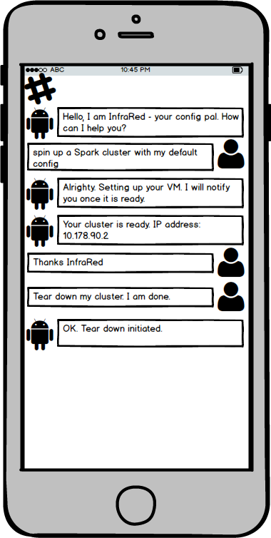
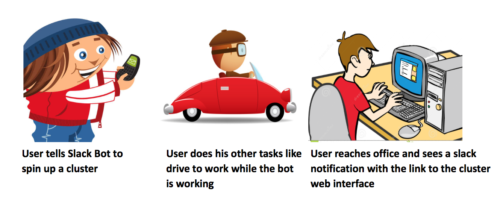
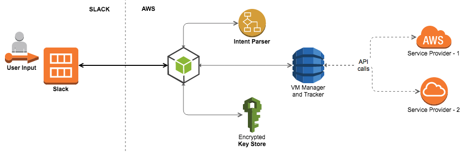

# Design Milestone

#### Background

Long gone are the days where each developer had dedicated build and test systems on-prem and the never ending tussles to acquire them. Virtualization allows resources to be better utilized while the advent of cloud computing has opened up a near infinite pool of compute resources available at demand and we are seeing a lot of companies embracing this new paradigm for the entire lifecycle of the project starting from development all the way to deployment. 

## Problem Statement

While traditional on-prem hardware was managed by a dedicated IT staff, the cloud based model relies more on the developer to manage his own resources bringing us to the common pain point that is provisioning of VMs. The entire process of spinning up VMs, provisioning and configuring them involves major command line bullshitery and tends to be a monotonous and time wasting task, laden with scope for messing up. The process is made multiplicatively more tiring when having to spin up entire clusters for various Big-Data or distributed applications.

Although DevOps practices have made this a lot more manageable in recent times, our approach takes this a step further providing an appliance like service for cloud provisioning through a Slack-bot. Such a solution while isolating the user from all the above mentioned issues, would also help in offloading the trivial tasks of finding the lowest pricing for the required resource, tracking utilization, potentially sharing already allocated resources with peers, etc. Not only would this afford the user greater ease of use *(allowing him to procure resources from a smartphone, while driving to work)* but also help the company save a load of cash by means of resource tracking and enabling ubiquitous access *(think of that one user who forgot to shut down his cluster before a long vacation)*.

## Bot Description

The Slack-Bot we propose for the problem at hand (**"InfraRed"**) would provide a natural language based interface into procuring VMs on the cloud *(akin to talking to the IT department, only simpler)* and keeping track of said resources to prevent excessive billing and to also provide timely notifications, liberating the user from his desk for the entire duration of the provisioning process, allowing valuable man hours to be better spent on more value generating work *(or for a quick game of foosball)*. This DevOps bot will assist in the following: 

* **API Key Management & Ubiquitous Access**

	Procuring cloud-resources often involves carefully hand-crafting REST API calls with unique access tokens. The first problem that our bot solves is of securely storing the users authorization tokens, thereby liberating him from the fear of keeping track of and even worse, exposing them publically. Since the bot is only accessible through Slack, their slack username would be enough to authenticate and run tasks on their behalf.

* **Provisioning**
	
	The core of the problem that the bot solves is that of automating the tiring process of spinning up VMs through a sequence of long-running API calls. Once spun-up, the VMs are automatically configured based on the users preferences *(setting up a certain dev/test environment or even settin up Hadoop/Spark on a cluster of such VMs)*. 
	
	We wish to further extend the functionality associated with Big-Data applications (Spark & Hadoop) by having the bot not only configure the cluster but also setup a public facing iPython Notebook or Apache Zeppelin interface, cutting down the need to SSH, making this use case accessible to even the not so technologically inclined userbase such as analysts.
	
* **Tracking**
	
	Once up and running, the bot takes up the responsibilites of tracking these resources and informing the user of various events such as a reservation-timeouts *(if the user informs the bot for how long he would need them)* or if the resources are sitting idle for extended periods of time, in an effort to prevent users from loosing track of existing resources.
	

### Design Sketches

* **Wireframe - Custom Cluster Setup**
	
	 

* **Wireframe - Custom VM Setup**
	
	
	
	
* **Wireframe - Default Cluster Setup**
	
	

* **StoryBoard**
	
	

## Architecture Design

The architectural implemenation of "InfraRed" can be broken down into the following:

* **Bot Implementation**
	
	The core logic for the Slack-Bot is implemented as a **node.js** application that establishes a socket connection to Slack and listens for direct-mentions ("@Infrared") and direct-messages. Each such event is handled asynchronously and the text message (unstructured data) sent by the user is passed along to the Intent parsing service to convert it into a structured JSON object. This structured data is used to build REST API calls for the various cloud service providers that the bot supports.
	
	Node.js was the platform of choice since the bot-implementation needs to be able to service a large number of requests on one side and effectively run a whole bunch of API calls to service said requests. An asynchronous framework was a clear choice and node.js was the most mature and widely used platform for this.

* **Natural Language Processing and Intent Recognition**
	
	We have decided to offload the natural language processing and intent recognition part of the job to a third-party AI service providers such as **wit.ai**.

* **Provisioning and Monitoring Service**
	
	The node.js based bot-implementation, upon parsing the text and filling in the required details for the resources the user has requested, contacts another subsystem of our project which is the provisioning and monitoring service. This service decouples the actual heavy-lifting associated with spinning up and provisioning the VMs, thereby allowing us to pick the programming language of choice and not be tied to node.js. This would also help us in making eventual debugging of the program much easier. This service is also responsible for frequently polling the VMs created and to send back events to the node.js component.
	
	
* **Secure Token Storage**
	
	The node.js bot-implementation is responsible for maintaining user-specific state information such as most commonly used configs, access tokens, etc. To implement this, we would need a database component to map user-names to their corresponding data. We would have to implement an encyption layer on top of the database to allow for the safe storage of user provided API access keys.

We plan to run all the above mentioned components hosted on **AWS**. And for the bot to be able to work, we would dictate a set of initial, one-time setup instructions that include adding the users access tokens and/or the organizations access keys. Since authentication and tracking is done at a per-user level, input is expected from any slack-user for whom the initial configuration was done.

### Additional Patterns

In this case, the Bot acts as a manager which accepts all the requests/commands from user(s) and initiates necessary actions at the cloud service. 
Thus, there will always be only one instance of the bot which continuously does the following tasks :
* Listens for requests from the user(s).
* Continuosly monitors the progress of the commands assigned to it.
* Provides periodic updates about the command back to the user(s).
* Keeps track of additional statistics. 

The bot is able to perform these tasks by spawning various daemons which in return reports information back to the bot. Command pattern is applicable to our system as users provide commands to InfraRed which is the receiver and invokes APIs to perform the action. Also, Observer Pattern is used in our system observes for any change in state of the infrastructure and accordingly notifies the client.So an appropriate combination would be a `Command` plus `Observer Design pattern`
