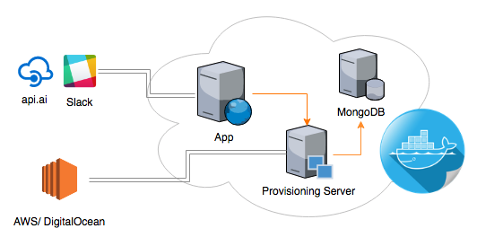

# Milestone: Deployment

Our Slack-Bot (InfraRed) was deployed using **Docker**. To orchestrate the spin up of all the containers required, we use **docker-compose**.

Docker Images define the setup required to run each of the application sub-components, namely "application-server", "provisioning-server" and "MongoDB". Containers are spun up for each of these images and the appropriate network connections are established using Docker Links. The trio of containers are sandboxed together in a network partition that is maintained by Docker and the only out of network communication that happens is to the services "api.ai", "slack", "aws" and "digital-ocean".

#### Setting up the Docker-Host

The entire docker-deployment is done on a Docker-Host VM that we provisioned on the cloud. To setup this host-vm *(ubuntu 14.04x64)*, we have written an Ansible-Playbook (playbook.yml).

	ansible-playbook -i inventory playbook.yml

##### API Tokens

The machine running the playbook must have the following environnment variables "APIAITOKEN" and "ALTCODETOKEN" set. 

These environment variables contain API tokens that are propogated to the Host-VM via ansible and then to the Docker containers to be used by the application. This method was utilized to prevent secret tokens from being read by others.

	
#### Deploying using Docker Compose
	
	docker-compose build
	docker-compose up

---

#### Screencast
[https://www.youtube.com/watch?v=bj01AvrSfgI](https://www.youtube.com/watch?v=bj01AvrSfgI)
