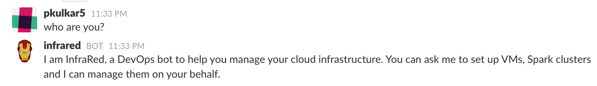
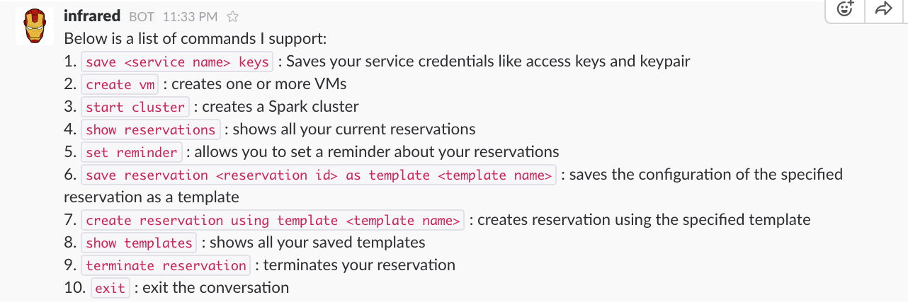
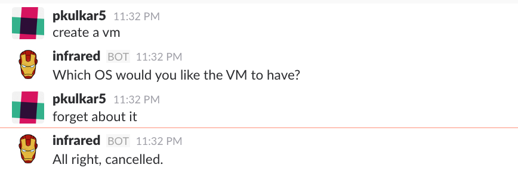

## Acceptance Tests

### Pre-requisites

You need to have keys set up on AWS/ Digital Ocean. You also need to generate keypair on AWS or ssh key on Digital Ocean. You will need the key pair name.

#### Get acquainted with InfraRed, the bot

You can start with some basic tests like asking the bot what it is and asking for commands to which the bot responds to.

	

	

#### Exit a conversation in the middle

If you want to exit the conversation anytime, you can do so by saying `exit`
 or `forget about it`

 	

 

