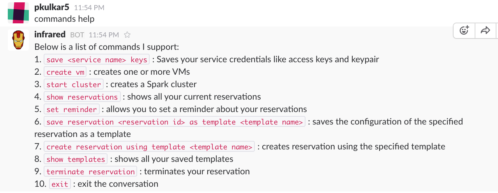
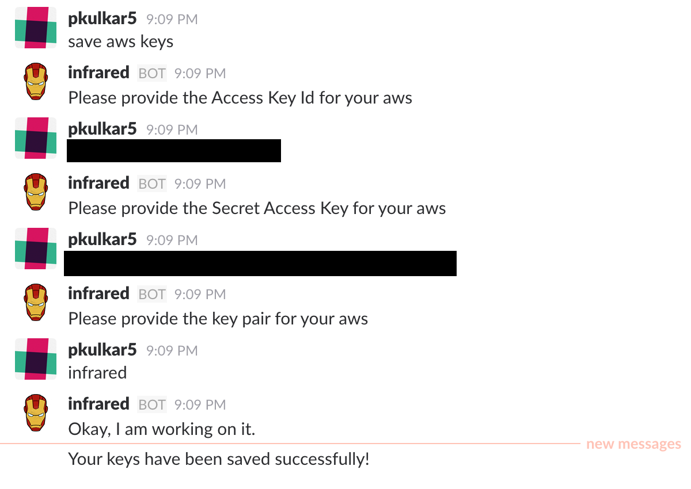

## Acceptance Tests

### Pre-requisites

You need to have keys set up on AWS/ Digital Ocean. You also need to generate keypair on AWS [AWS - Getting Started](https://aws.amazon.com/documentation/) or ssh key on Digital Ocean [Digital Ocean - Getting Started](https://www.digitalocean.com/help/). You will need the key pair name. In case you want to set up a Spark cluster, you need to activate your AWS account for Amazon EMR. For more information on how to do that, please visit [Amazon EMR - Getting Started](http://docs.aws.amazon.com/ElasticMapReduce/latest/DeveloperGuide/emr-get-started.html)

### Get acquainted with InfraRed, the bot

You can start with some basic tests like asking the bot what it is and asking for commands to which the bot responds to.

### Exit a conversation in the middle

If you want to exit the conversation anytime, you can do so by saying `exit`
 or `forget about it`

### Save keys

You can have 2 dialogs - one for saving AWS keys and the other for Digital Ocean Keys

Saving AWS keys - happy path where you provide right credentials. Validation of keys is done before saving the keys

Saving Digital Ocean keys - happy path where you provide right credentials. Validation of keys is done before saving the keys

Saving Keys - sad path where incorrect keys fail authentication

### Create VM

To create a vm, you simply need to tell the bot - `create vm`. You will be asked a set of questions that are configuration values for your vm. The service is smart enough to pick the closest matching config with lowest price. Your vm will be created either on aws on digital ocean if you have both keys set up else it will be created on the only provider for which your keys are saved.

This config results in creation of vm on AWS

This config results in creation of vm on Digital Ocean

If you don't have keys set up, the bot replies with an appropriate message. Hence you need to have keys set up before you can create a vm/cluster

### Show reservations

To view all your active reservations, you simply need to tell the bot - `show reservations`.

### Set reminder

To set a reminder about your reservations, you simply need to tell the bot - `set reminder`. This will remind you about your reservations after specified time. You can then terminate after the reminder.

### Save template

This is a very handy way to spin up your vm/cluster. You can save your common configs as templates in the bot and tell the bot to spin up using your template name. You can take one of your existing reservations and tell the bot to save it as a template: `save reservation <reservation id> as template <template name>`

### Create reservation using template

You can quickly create a reservation using your template name as follows: `create reservation using template <template name>`

### Show templates

You can view your saved templates with their config as follows: `show my templates`

### Terminate reservation

You can tear down a reservation using a reservation id or ask the bot to remind you to terminate: `tear down reservation <reservation id>` or `remind me about my reservations` or `set reminder`

After terminating, if you do `show reservations`, you will see reduced number of reservations

### Create cluster

You can create a spark cluster by saying `start cluster` or `spin up a spark cluster`. Cluster creation takes about 8 mins and once ready, you will get a Zeppelin link where you can write and run Apache Spark code.

